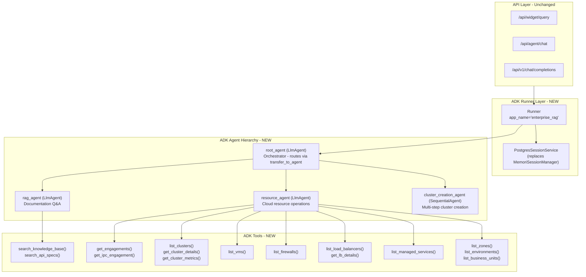

# Google ADK Framework Integration Plan

## Current vs New Architecture

### Current Architecture (LangChain-based)

The current system uses a custom multi-agent framework built on LangChain's `AgentExecutor`, `ChatOpenAI`, and `Tool` primitives. The agent pipeline is:

```
OrchestratorAgent → IntentAgent → ValidationAgent → ExecutionAgent → ResourceAgents
```

Key problems with the current approach:

- **Fragile routing**: Custom `_decide_routing()` with hardcoded rules + LLM classification
- **Override-heavy**: Every agent overrides `execute()` and bypasses `AgentExecutor`, making LangChain mostly dead weight
- **No native multi-agent**: Agents communicate via manual state passing and method calls
- **Session management is DIY**: Custom `ConversationStateManager` + `MemoriSessionManager`
- **No streaming**: Responses are fully buffered

### New Architecture (ADK-based)

ADK provides first-class multi-agent support, LLM-driven delegation (`transfer_to_agent`), workflow agents, and structured session/state management.




## Key Design Decisions

### 1. Model: Grok via LiteLlm

Since the project uses Grok (Tata's OpenAI-compatible API), we use ADK's `LiteLlm` connector:

```python
from google.adk.models.lite_llm import LiteLlm

grok_model = LiteLlm(
    model="openai/Qwen/Qwen2.5-Coder-14B-Instruct",
    api_key=os.getenv("GROK_API_KEY"),
    api_base=os.getenv("GROK_BASE_URL")
)
```

### 2. Agent Hierarchy: 3 Specialized Sub-Agents

Instead of the current 4-agent pipeline (Intent -> Validation -> Execution -> Resource), ADK's LLM-driven delegation simplifies this to:

- **root_agent**: Orchestrator that uses `transfer_to_agent()` to route to the right sub-agent based on the user's query. Handles greetings/capability questions directly.
- **rag_agent**: Handles documentation/knowledge questions using RAG search tools. No API calls.
- **resource_agent**: Handles ALL cloud resource operations (list, create, get details). Equipped with tools for each operation. The LLM decides which tool to call and handles parameter extraction natively.
- **cluster_creation_agent** (SequentialAgent): Multi-step cluster creation workflow with param collection and execution steps.

### 3. Tools Replace Resource Agents

Current resource agents (`K8sClusterAgent`, `LoadBalancerAgent`, etc.) become plain Python functions wrapped as ADK `FunctionTool`s. The LLM in `resource_agent` decides which tool to invoke based on the user query -- no separate intent detection needed.

### 4. Session: PostgresSessionService

Replace `ConversationStateManager` + `MemoriSessionManager` with a custom ADK `SessionService` backed by PostgreSQL, using the existing `conversation_sessions` table.

## File-by-File Changes

### New Files to Create


| File                         | Purpose                                                                         |
| ---------------------------- | ------------------------------------------------------------------------------- |
| `app/adk/__init__.py`        | ADK package init                                                                |
| `app/adk/agents.py`          | All ADK agent definitions (root, rag, resource, cluster workflow)               |
| `app/adk/tools.py`           | All FunctionTool definitions wrapping existing service logic                    |
| `app/adk/runner.py`          | ADK Runner setup, session service, and the main `process_request()` entry point |
| `app/adk/session_service.py` | Custom PostgresSessionService implementing ADK's SessionService interface       |


### Files to Modify


| File                                                                 | Change                                                                      |
| -------------------------------------------------------------------- | --------------------------------------------------------------------------- |
| [app/api/routes/rag_widget.py](app/api/routes/rag_widget.py)         | Replace `get_agent_manager().process_request()` calls with ADK runner calls |
| [app/api/routes/agent_chat.py](app/api/routes/agent_chat.py)         | Replace `AgentManager` usage with ADK runner                                |
| [app/routers/openai_compatible.py](app/routers/openai_compatible.py) | Update widget query flow to use ADK                                         |
| [app/main.py](app/main.py)                                           | Initialize ADK runner on startup instead of `AgentManager`                  |
| [requirements.txt](requirements.txt)                                 | Add `google-adk` and `litellm`                                              |


### Files Preserved (No Changes)


| File                                   | Reason                                       |
| -------------------------------------- | -------------------------------------------- |
| `app/services/api_executor_service.py` | Core API execution logic reused by ADK tools |
| `app/services/postgres_service.py`     | RAG search reused by ADK tools               |
| `app/services/ai_service.py`           | Embedding generation unchanged               |
| All `metadata/api_spec_chunks/*.md`    | RAG content unchanged                        |
| `angular-frontend/`                    | Frontend unchanged                           |


### Files Deprecated (kept but no longer imported)


| File                                         | Replaced By                                   |
| -------------------------------------------- | --------------------------------------------- |
| `app/agents/base_agent.py`                   | ADK `LlmAgent` / `BaseAgent`                  |
| `app/agents/orchestrator_agent.py`           | `app/adk/agents.py` root_agent                |
| `app/agents/intent_agent.py`                 | LLM-native intent detection in resource_agent |
| `app/agents/validation_agent.py`             | LLM-native param extraction in resource_agent |
| `app/agents/execution_agent.py`              | ADK tools in resource_agent                   |
| `app/agents/rag_agent.py`                    | `app/adk/agents.py` rag_agent                 |
| `app/agents/agent_manager.py`                | `app/adk/runner.py`                           |
| `app/agents/resource_agents/*.py`            | `app/adk/tools.py`                            |
| `app/agents/state/conversation_state.py`     | ADK SessionService + session.state            |
| `app/agents/state/memori_session_manager.py` | `app/adk/session_service.py`                  |


## Detailed Implementation for Each New File

### `app/adk/tools.py` -- ADK Function Tools

Wraps existing service methods as ADK-compatible tools. Each tool is a plain async function with typed parameters and docstrings (ADK auto-wraps them as `FunctionTool`).

Key tools to implement:

- `get_engagements(tool_context: ToolContext) -> dict` -- calls `api_executor_service.get_engagements_list()`
- `get_ipc_engagement(engagement_id: int, tool_context: ToolContext) -> dict` -- converts PAAS to IPC
- `list_k8s_clusters(tool_context: ToolContext) -> dict` -- fetches clusters via api_executor
- `list_vms(tool_context: ToolContext) -> dict`
- `list_firewalls(tool_context: ToolContext) -> dict`
- `list_load_balancers(tool_context: ToolContext) -> dict`
- `get_lb_details(lbci: str, tool_context: ToolContext) -> dict`
- `list_managed_services(service_type: str, tool_context: ToolContext) -> dict`
- `list_zones(tool_context: ToolContext) -> dict`
- `list_environments(tool_context: ToolContext) -> dict`
- `list_business_units(tool_context: ToolContext) -> dict`
- `search_knowledge_base(query: str, tool_context: ToolContext) -> dict` -- RAG search
- `search_api_specs(query: str, tool_context: ToolContext) -> dict`

Each tool reads auth_token from `tool_context.state["auth_token"]` and engagement_id from `tool_context.state.get("engagement_id")`, and stores results back in state.

### `app/adk/agents.py` -- Agent Definitions

```python
from google.adk.agents import LlmAgent, SequentialAgent
from google.adk.models.lite_llm import LiteLlm
from app.adk.tools import (
    get_engagements, list_k8s_clusters, list_vms,
    list_firewalls, list_load_balancers, list_managed_services,
    search_knowledge_base, ...
)

grok_model = LiteLlm(
    model="openai/Qwen/Qwen2.5-Coder-14B-Instruct",
    api_key=os.getenv("GROK_API_KEY"),
    api_base=os.getenv("GROK_BASE_URL"),
)

rag_agent = LlmAgent(
    model=grok_model,
    name="rag_agent",
    description="Answers questions about Vayu Maya platform documentation, ...",
    instruction="...detailed RAG instructions...",
    tools=[search_knowledge_base],
)

resource_agent = LlmAgent(
    model=grok_model,
    name="resource_agent",
    description="Manages cloud resources: K8s clusters, VMs, firewalls, ...",
    instruction="...detailed resource operation instructions...",
    tools=[
        get_engagements, list_k8s_clusters, list_vms,
        list_firewalls, list_load_balancers, list_managed_services, ...
    ],
)

root_agent = LlmAgent(
    model=grok_model,
    name="root_agent",
    description="Main orchestrator for Vayu Maya AI Cloud Assistant",
    instruction="...routing instructions...",
    sub_agents=[rag_agent, resource_agent],
)
```

The `root_agent`'s LLM naturally routes via `transfer_to_agent()` based on sub-agent descriptions.

### `app/adk/runner.py` -- Runner and Entry Point

```python
from google.adk.runners import Runner
from google.adk.sessions import InMemorySessionService
from google.genai import types
from app.adk.agents import root_agent
from app.adk.session_service import PostgresSessionService

session_service = PostgresSessionService(...)  # or InMemorySessionService() for dev
runner = Runner(agent=root_agent, app_name="enterprise_rag", session_service=session_service)

async def process_request(user_input, session_id, user_id, auth_token, user_type):
    """Main entry point replacing AgentManager.process_request()"""
    # Create or get session
    session = await session_service.get_session(
        app_name="enterprise_rag", user_id=user_id, session_id=session_id)
    if not session:
        session = await session_service.create_session(
            app_name="enterprise_rag", user_id=user_id, session_id=session_id,
            state={"auth_token": auth_token, "user_type": user_type})

    content = types.Content(role="user", parts=[types.Part(text=user_input)])
    events = runner.run(user_id=user_id, session_id=session_id, new_message=content)

    # Collect final response
    for event in events:
        if event.is_final_response():
            return format_response(event)
```

### `app/adk/session_service.py` -- PostgreSQL Session Persistence

Custom implementation of ADK's `BaseSessionService` that stores sessions in the existing PostgreSQL database, replacing the custom `MemoriSessionManager`.

## Migration Strategy

The migration is designed to be **non-breaking** -- old agent code stays in place but is no longer imported. The API layer is the only integration point that changes.

### Phase 1: Foundation (Tools + Agents + Runner)

Create all new files under `app/adk/`. Test independently using ADK's built-in `adk web` dev UI.

### Phase 2: API Integration

Update [app/api/routes/rag_widget.py](app/api/routes/rag_widget.py) and [app/api/routes/agent_chat.py](app/api/routes/agent_chat.py) to call the new ADK runner instead of `AgentManager`.

### Phase 3: Session Migration

Implement `PostgresSessionService` and wire it into the runner.

### Phase 4: Cleanup and Testing

Test all 30 query types, verify streaming, remove dead LangChain imports from requirements.